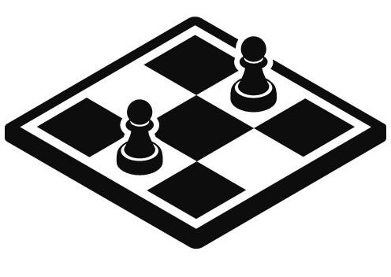

# 2D-Chess

**Author:** [Kevin COOVI](https://www.linkedin.com/in/kevin-coovi/)

This project served as a learning experience, strengthening my skills in web development, Flask, and the integration of front-end and back-end components.

# Table of Contents

- [Project Structure](#project-structure)
- [Challenges](#challenges)
- [Prerequisite for Linux and Windows](#prerequisite-for-linux-and-windows)
- [Playing the Game](#playing-the-game)

## Project Structure

- **app.py:** This is the main Flask application file.
- **templates/:** This directory contains HTML templates.
  - **index.html:** The main HTML file for rendering the chessboard and game interface.
- **static/:** This directory is used to store static files (CSS, JavaScript, and images).
  - **img/:** This subdirectory contains chess piece images.
  - **styles.css:** The CSS file for styling the HTML.
  - **scripts.js:** The JavaScript file for handling chessboard interactions.

## Challenges

- Unresolved issue with piece movement validation.

## Prerequisite for Linux and Windows

1. Ensure you have Python and git installed on your system.

   - [Python](https://www.python.org/downloads/) & [Git](https://git-scm.com/download/win) for Windows

2. Open the terminal on Linux or Cmd on Windows and Clone the repository

   ```bash
   git clone https://github.com/kcoovi/2D-Chess.git

   ```

3. Navigate to the 2D-Chess directory

   - For Linux:

   ```bash
   cd 2D-Chess
   ```

   - For Windows:

   ```bash
   CD 2D-Chess
   ```

4. Install Flask **if not** already installed

   ```bash
   pip install Flask
   ```

## Playing the game

1. Run the application while in the 2D-Chess Directory

   - For Linux:

   ```bash
   python3 app.py
   ```

   - For Windows:

   ```bash
   python app.py
   ```

2. Open your browser at http://127.0.0.1:5000/ to play.
